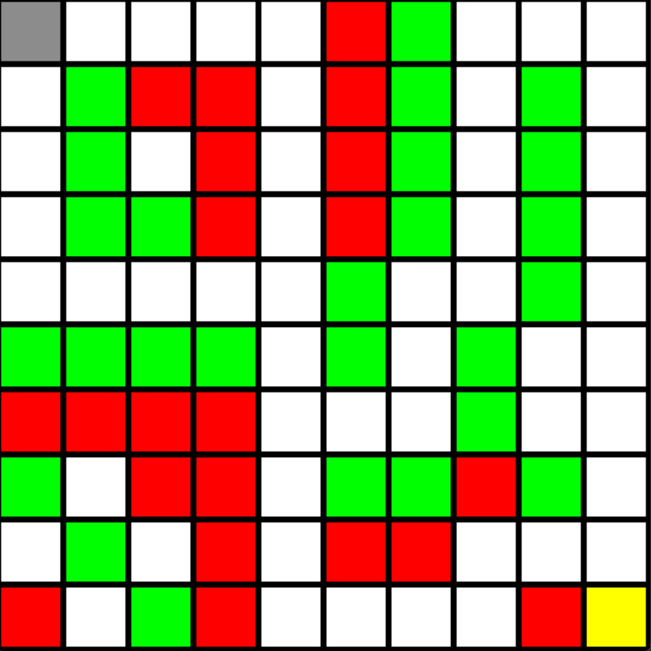
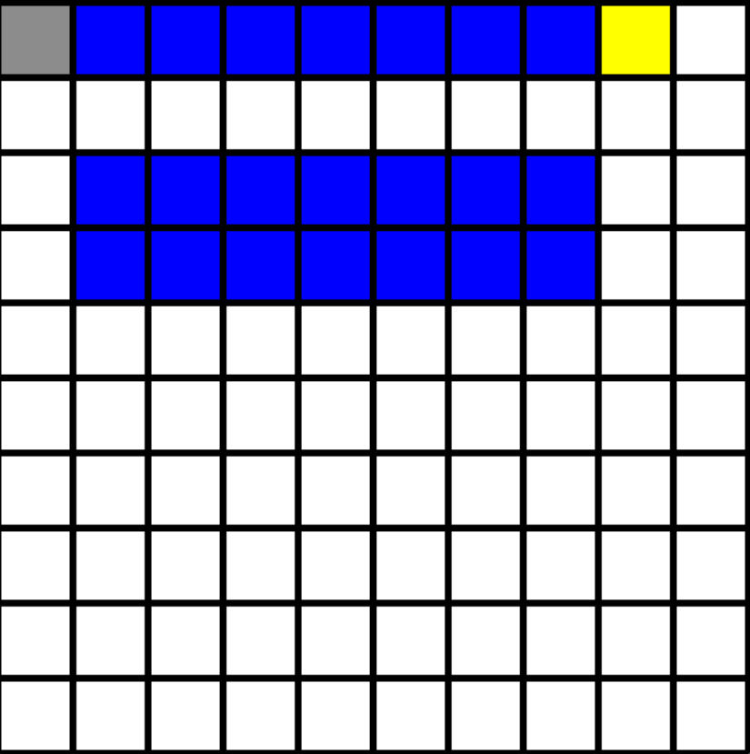
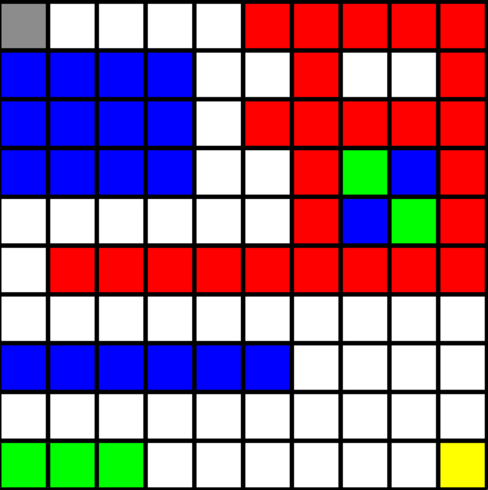

# Q-Learning and SARSA in Grid Worlds

**Qiaoyuan Zheng · ESIEE Paris · Summer 2023**

An exploratory reinforcement-learning project studying how agents navigate competing routes through cliffs, marshes, and obstacles. The repository brings together tabular learning agents, 15 custom grid worlds, learning curves, and visual analysis of route choices.

## Start with the showcase

**[Open `showcase.ipynb`](grid_world/showcase.ipynb)** — the main presentation of this project, with saved outputs that can be browsed without running the experiments.

[Alternative notebook viewer](https://nbviewer.org/github/qiaoyuan667/Q-learning-Sarsa-DQN-in-grid-world/blob/main/grid_world/showcase.ipynb) · [Interactive experiment notebook](grid_world/main.ipynb) · [Map definitions and settings](grid_world/datas.json)

The showcase walks through all 15 environments. Each map section combines experiment code, saved steps-per-episode curves, a map illustration, numerical summaries, and a short interpretation of the observed behavior. It asks a simple question: **when does a shorter route cease to be a better route?**

### A quick visual tour

| Cliffs: maps 1–5 | Marshes: maps 6–10 | Mixed terrain: maps 11–15 |
| --- | --- | --- |
|  |  |  |
| Explore shortcuts near reset hazards. | Compare shorter paths with terrain penalties. | Examine competing routes with multiple types of hazard. |

**Map colors:** white = road, green = wall, red = cliff, blue = marsh, gray = starting position, yellow = goal. In the environment code, entering a cliff returns the agent to the start; marsh cells receive a configurable reward penalty.

### Suggested reading route

1. **Map 1:** begin with alternative routes around walls and cliffs, then compare the saved learning curves and the accompanying discussion.
2. **Maps 6–10:** inspect how marsh penalties change the trade-off between route length and reward. Fewer steps alone do not imply a better policy.
3. **Maps 11–15:** explore mixed terrain, where the notebook discusses how exposure to different hazards can change route preferences.

The interpretations describe the notebook's recorded experiments, not universal guarantees about either algorithm.

## What is included

- Dictionary-based Q-tables, epsilon-greedy action selection, and Q-learning / SARSA update rules.
- Fifteen 10 × 10 environments with per-map learning parameters, reward settings, and step limits.
- Steps-per-episode plots, exploration schedules, and saved Q-table checkpoints.
- Pygame visualization for replaying trained agents in `main.ipynb`.

| File | Purpose |
| --- | --- |
| [`grid_world/showcase.ipynb`](grid_world/showcase.ipynb) | Main results walkthrough, saved plots, map images, and commentary. |
| [`grid_world/main.ipynb`](grid_world/main.ipynb) | Select a map, train agents, and replay policies in a desktop window. |
| [`grid_world/datas.json`](grid_world/datas.json) | Map layouts, starting coordinates, rewards, and training settings. |
| [`grid_world/write.ipynb`](grid_world/write.ipynb) | Define and export map configurations; running its export cell overwrites `datas.json`. |
| `grid_world/map_1.png` … `map_15.png` | Illustrations used in the showcase. |

## Run locally

The notebooks were authored with Python 3.10.5. The commands below install their direct dependencies and JupyterLab; this repository does not include a pinned environment.

```bash
git clone https://github.com/qiaoyuan667/Q-learning-Sarsa-DQN-in-grid-world.git
cd Q-learning-Sarsa-DQN-in-grid-world
python3 -m venv .venv
source .venv/bin/activate
python -m pip install jupyterlab ipykernel numpy matplotlib pygame
cd grid_world
python -m jupyterlab showcase.ipynb
```

On Windows, activate the environment with `.venv\Scripts\activate` instead.

**Launch from `grid_world/`.** The notebooks load `datas.json`, images, and checkpoints using relative paths.

### Re-run a showcase example

1. Run the imports/data-loading cell and the cell defining both agents.
2. Choose one map-specific code cell, identified by `map_name="map_1"` through `map_name="map_15"`.
3. Run that cell to execute its experiments and display its outputs. Start with one map rather than running the entire notebook: the stored configurations use 10,000–40,000 episodes, and each map cell also invokes an additional repeated-training routine.

### Replay an agent

Open `main.ipynb`, set `map_name` near the top, and execute the environment, agent, and training cells in order. Train before running `SimulationQlearningAgent(...)` or `SimulationSarsaAgent(...)`: these functions load generated `.pkl` checkpoints, which are not included in the repository. Keep the selected map and checkpoint episode consistent. Pygame replay requires a local graphical desktop; close its window to finish the simulation cell. Only load pickle files you trust.

## Interpreting the experiments

This is an educational project archive, not a controlled benchmark. Random seeds and dependency versions are not fixed, and the repeated-training routine retains learned agent state between repetitions rather than performing independent seeded trials. The original SARSA loop also samples a fresh action on the next iteration instead of carrying forward the action used in its update. These details should be reviewed before using the results for a rigorous algorithm comparison.

The repository name mentions DQN, but the checked-in notebooks implement tabular Q-learning and SARSA; no DQN implementation is included.

## Author

[Qiaoyuan Zheng](https://qiaoyuan-zheng.com/) · [GitHub](https://github.com/qiaoyuan667)
